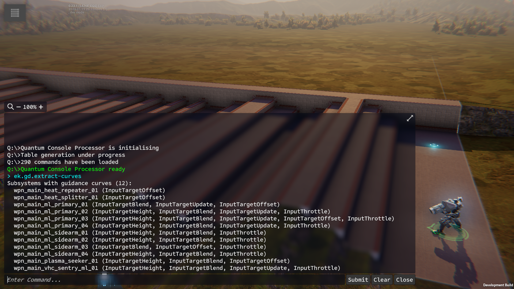
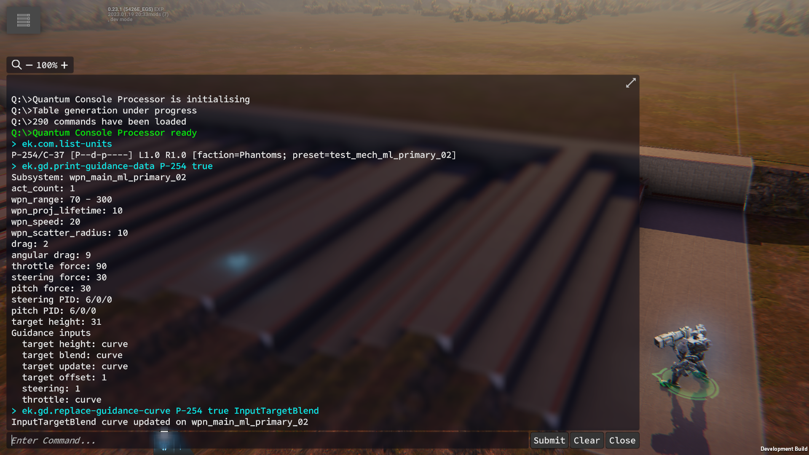

# CurveTools

A set of tools for [Phantom Brigade (Alpha)](https://braceyourselfgames.com/phantom-brigade/) to help mod missile launchers.

It is compatible with game patch **0.23.1-b5426**. That is an **EXPERIMENTAL** release. All library mods are fragile and susceptible to breakage whenever a new version is released.

Missile launchers use a number of property and animation curves to determine the trajectories of the missiles they launch. It can be hard to visualize the results when changing the properties or curves of a missile launcher in the YAML configuration files. With the tools in this repo, you can graphically edit the curves using the nifty animation curve editor that's built into Unity Editor and then load that curve into the running game. The other properties of missile launchers can be inspected and changed in the running game as well. This shortens the cycle for making changes to missile launchers.

There are two separate tools that are used in conjuction with each other. The first is a library mod, GuidanceCurve, that has a variety of console commands to extract guidance curves, load new guidance curves and change other properties of missile launchers that influence the behavior of missiles. The second tool is a Unity project that adds a window that lets you load and edit the extracted guidance curves.

## Using the GuidanceCurve Mod

The GuidanceCurve mod is a normal library mod that registers a few QuantumConsole commands and installs a couple of test scenarios. You can use the test scenarios to launch the game directly into a test combat setting that has a single unit preconfigured with a missile launcher. The configured missile launcher is `wpn_main_ml_primary_02` which fires a single missile.

The work cycle I use is as follows.

- Launch game with test scenario.
- Extract all the guidance curves (this needs to be done only once).
- Change a property or load a curve on the missile launcher.
- Fire the missile launcher enough times to get a sense of how the missile flies.
- Tweak the property/curve and fire again; repeat until the missile performs the way I want it to.

To launch the game directly into one of the test scenarios, you will need to modify your debug.yaml settings file. Add these two lines to it.

```
combatScenarioLoaded: true
combatScenarioLoadedKey: debug_empty_missiles
```

I typically use the `debug_empty_missiles` scenario but there's the more interesting `debug_shootingrange_missiles` scenario available as well.

If I haven't extracted the stock curves yet -- and you'll need to do this for every release -- I'll create a `Curves\Guidance` folder in the GuidanceCurve mod folder and run the `ek.gd.extract-curves` command in the console.



This will dump YAML files into subfolders in the `Curves\Guidance` folder for all the subsystems that have guidance input curves. The resulting file structure will look something like the following.

```
C:\USERS\<username>\APPDATA\LOCAL\PHANTOMBRIGADE\MODS\GUIDANCECURVE\CURVES
+---Guidance
    +---InputSteering
    +---InputTargetBlend
    ¦       wpn_main_ml_primary_01.yaml
    ¦       wpn_main_ml_primary_02.yaml
    ¦       wpn_main_ml_primary_03.yaml
    ¦       wpn_main_ml_primary_04.yaml
    ¦       wpn_main_ml_sidearm_01.yaml
    ¦       wpn_main_ml_sidearm_02.yaml
    ¦       wpn_main_ml_sidearm_03.yaml
    ¦       wpn_main_ml_sidearm_04.yaml
    ¦       wpn_main_plasma_seeker_01.yaml
    ¦       wpn_main_vhc_sentry_ml_01.yaml
    ¦
    +---InputTargetHeight
    ¦       wpn_main_ml_primary_02.yaml
    ¦       wpn_main_ml_primary_03.yaml
    ¦       wpn_main_ml_primary_04.yaml
    ¦       wpn_main_ml_sidearm_01.yaml
    ¦       wpn_main_ml_sidearm_02.yaml
    ¦       wpn_main_ml_sidearm_04.yaml
    ¦       wpn_main_plasma_seeker_01.yaml
    ¦       wpn_main_vhc_sentry_ml_01.yaml
    ¦
    +---InputTargetOffset
    ¦       wpn_main_heat_repeater_01.yaml
    ¦       wpn_main_heat_splitter_01.yaml
    ¦       wpn_main_ml_primary_01.yaml
    ¦       wpn_main_ml_primary_03.yaml
    ¦       wpn_main_ml_sidearm_03.yaml
    ¦       wpn_main_plasma_seeker_01.yaml
    ¦
    +---InputTargetUpdate
    ¦       wpn_main_ml_primary_01.yaml
    ¦       wpn_main_ml_primary_02.yaml
    ¦       wpn_main_ml_primary_03.yaml
    ¦       wpn_main_ml_primary_04.yaml
    ¦       wpn_main_vhc_sentry_ml_01.yaml
    ¦
    +---InputThrottle
            wpn_main_ml_primary_02.yaml
            wpn_main_ml_primary_03.yaml
            wpn_main_ml_primary_04.yaml
            wpn_main_ml_sidearm_01.yaml
            wpn_main_ml_sidearm_02.yaml
            wpn_main_ml_sidearm_03.yaml
            wpn_main_ml_sidearm_04.yaml
            wpn_main_vhc_sentry_ml_01.yaml
```

I leave the game running while I change the curves. Waiting for the game to load up takes a while and often I'll have to iterate a number of times when changing these curves so that wait time really starts to add up.

After I've changed a curve, I'll reload the curve into the game. This mod only makes changes to the subsystem of the missile launcher on the test unit. I generally work on a single missile launcher at a time, tweaking all the properties and curves until I get the result I want before moving on to the next missile launcher. To change the missile launcher, I change the unit preset in the mod's scenario files.

There are a few console commands that are useful when changing the properties/curves of the missile launcher. Here's an example screenshot for changing the `InputTargetBlend` curve.



The first command is `ek.com.list-units` where I get the unit's persistent entity identifier. In this case that's `P-254`. This is used in the subsequent commands.

The next command is `ek.gd.print-guidance-data` which will print out all the relevant weapon stats and guidance properties to the console. This will let you see how the missile launcher is currently configured.

The last command is `ek.gd.replace-guidance-curve` which reads in the selected curve and applies it to the missile launcher. In this case it is loading the `InputTargetBlend` for subsystem `wpn_main_ml_primary_02` from the `Curves\Guidance` file structure and updating the test unit's primary weapon.

At this point I'll test the change in the scenario. It's best to change one thing at a time because there is a complicated interplay between all the guidance properties and curves. I'll fire missiles at a number of distances within the weapon's range because the missiles can behave very differently when aimed at close targets versus distant targets.

There are number of commands to change all the guidance properties and inputs. You can replace curves with constants or linear inputs and you can change esoteric properties like the PID values. QuantumConsole by default will list all available commands and will narrow them down as you type so you can enter `ek.gd.` to get just the commands for changing guidance properties/curves.

In the code for the mod is a function to batch load custom curves. The function is in the `DataMultiLinkerSubsystem` class and is named `UpdateCurves`. It should be added as a postfix patch to `DataLinkerInitSystem.Initialize()`. You can use this in your own mod once you have the missile lauchers working the way you want them to.

## Using the CurveEditor Unity Project

Only the control points for the hermite splines are stored when animation curves are serialized to YAML. I'm not that good at mentally visualizing the full curve from these control points so I built a simple tool in the Unity Editor to let me see and change the curve.

The project is a barebones 3D Unity project. It adds an entry to the Window menu named "View Curve". Going to Window > View Curve will bring up a standalone window with a few sections. The first section you should look at is "Original Curve Paths". Expand this out and change the directories to match where you've stored your curves. I use the `subst` command from a command prompt to create shortcut drives to my folders.

The next section you should examine is the "Save Paths" section. Here's where you'll set the folder to save modified curves to. I save my modified curves to a different folder than the stock curves so I don't have to keep extracting the stock curves.

You can ignore the "Damage Curves" section. Damage falloff curves are used mostly for ballistic weapons. I tweak them so that weapons like rifles and shotguns have larger zones for doing full damage but that's not the point of the tools in this repo.

The main section you'll use is the "Guidance Curves" section. I've organized guidance curves by their input type. Once you choose an input type, you'll get another dropdown that lists all the subsystems that have a curve for that input type. Picking a subsystem will make the animation curve widget appear. Clicking on the curve widget will bring up the curve editor where you can change the curve.

After editing a curve, close the curve editor window and go back to the CurveViewer window. At the bottom are some widgets to show where the modified curve will be saved and a button to do the save.
